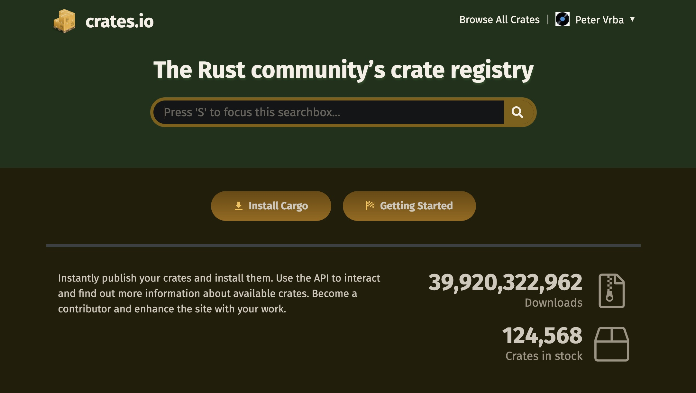

# Package registry

All packages are exposed at [crates.io](http://crates.io), currently there are over
120.000 packages available.

We are using packages from crates.io as dependencies of our projects, but you can also share your code with other people by publishing your own packages. The crate registry at crates.io distributes the source code of your packages, so it primarily hosts code that is open source.

